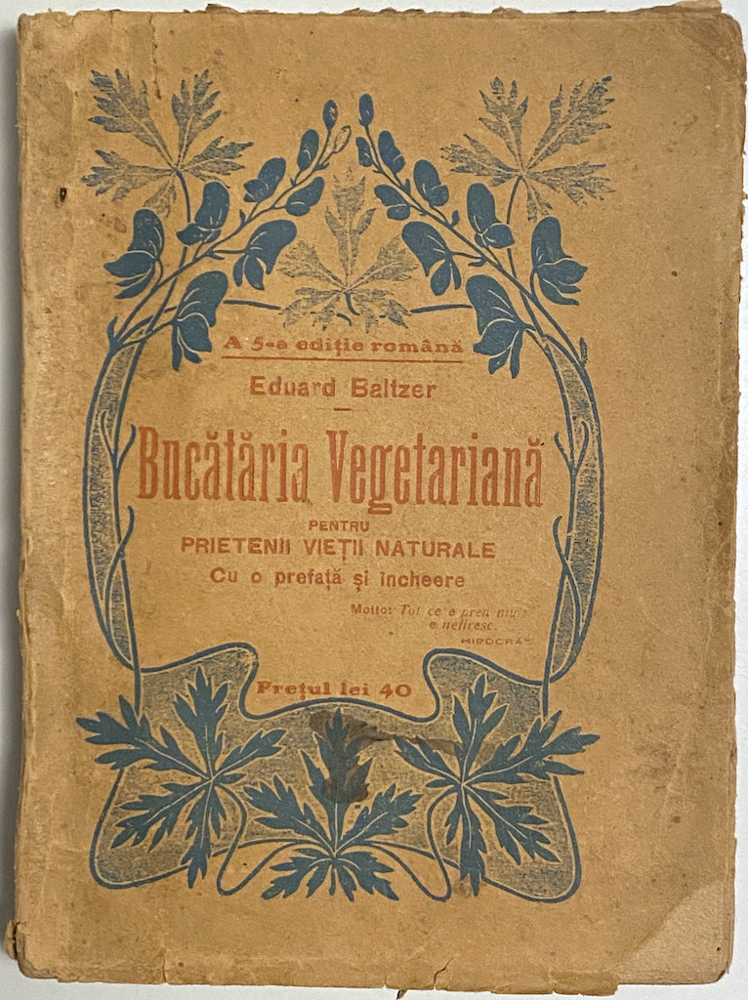
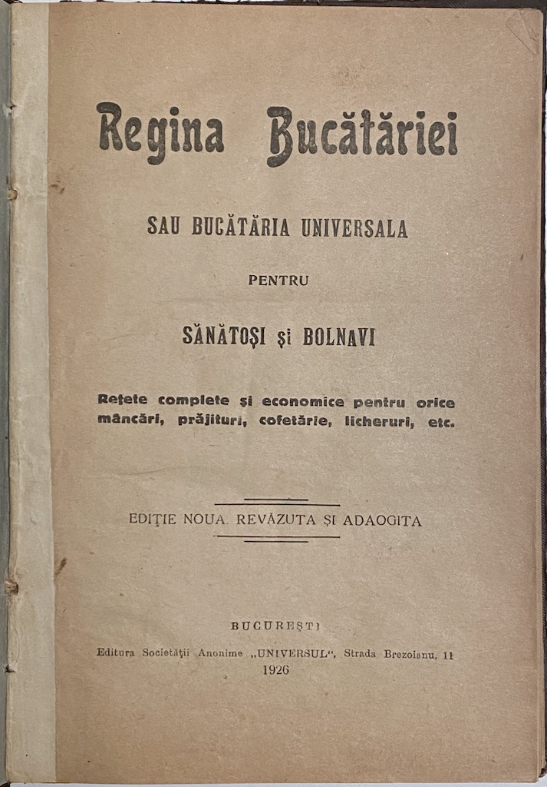

# culinaria

Bibliografie culinară

## Cărți

Copertă | Descriere
------- | ----------
 | Post. Manolaki Drăghici, _Rețete cercate în număr de 500 din bucătăria cea mare a lui Robert, întâiul bucătar al Curții Spaniei_, Tipografia Institutul Albinei, Iașii, 1846.
 | Ecaterina Steriad (Colonel), _Buna menageră_, Edițiunea a II-a, Editura Librăriei Socecu & Co., Bucuresci, 1874.
 | Eduard Baltzer, Toma Simionescu (trad.), _Bucătăria vegetariană_, a 5-a ediție în română, Tipografiile Române Unite, București, după 1925.
 | X. X., _Regina bucătăriei sau Bucătăria universală pentru sănătoși și bolnavi_, Ediție nouă revăzută și adăugită, Editura Societății Anonime „Universul”, București, 1926.
 | Ecaterina Comșa, _Buna menajeră sau Carte de bucate_, Ediția a VI-a, Editura Librăriei SOCEC & Co., Societ. Anonimă, București, 1929.
 | Lucreția Dr. Opreanu, _Bucătărie românească_, Tip. „Ardealul”, Cluj, 1935.
 | Constantin Bacalbașa (prefață), _Dictatura gastronomică, 1501 feluri de mâncări_, Tipografia ziarului „Universul”, București, 1935.
 | Ing. Alex. N. Pascu, _Bucătăria practică_, Depozitul: Ing. Alex. N. Pascu, București, 1936.
 | Elena Constantinescu, _Bucătăria gospodinei române_, Institut de arte grafice A. Grozea, București, 1936.
 | Elena Constantinescu, _Bucătăria gospodinei române_, Tip. „Tirajul”, București, 1937.
 | B. Madeleine, _Ce mâncăm azi?_, Editura „Naționala-Ciornei” S.A., București, 1937 sau mai devreme.
 | B. Madeleine, _Bucătăria într'o oră_, Atelierele Grafice Socec & Co. S.A., București, 1937.
 | Elisabeta Ciortan, Xenia Nicolau, _Bucătăria rațională, rețete de mâncări_, Volumul IV, Ediția a II-a, Tipografia „Universul”, București, 1943.
| Mihail Kogălniceanu, Costache Negruzzi, _200 rețete cercate de bucate, prăjituri și alte trebi gospodărești_, Editura Dacia, Cluj, 1973.
 | Octavian Stoica, _De-ale gurii din bătrîni_, Editura Sport-Turism, București, 1978.
| Ioana Constantinescu, Matei Cazacu, _O lume într-o carte de bucate: manuscris din epoca brâncovenească_, Editura Fundaţiei Culturale Române, București, 1997.
 | Constantin Bacalbașa (prefață), Dan-Silviu Boerescu (prefață și note), _Dictatura gastronomică, 1501 de feluri de mâncări din 1935_, Lifestyle Classic, Editura Trei, București, 2009.